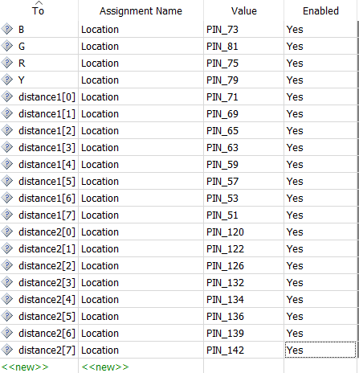
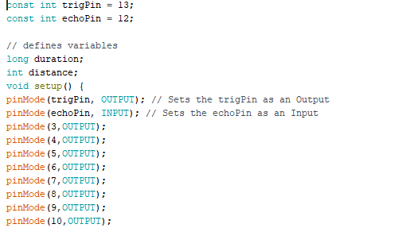

# Calamity Companion

Unseen pits are one of the major issues while driving on flooded roads.
This project indicates the user about the pits on the road ahead.There are ultrasound range sensors in the device which measures the distance of the sensor from the ground. There are two such sensors. The difference of the reading of these sensors is used to predict the depth of the pit during
floods. The device then accordingly glows the LEDs and buzzers, To assist the user ensuring his/her safety.

## Prerequisites

To clone the project, you will need the following software: 
1.	Quartus II.
2.	Arduino Software.

And the following hardware, will be needed.
1.	1 * FPGA Cyclone Board.
2.	2 * Arduino UNO Boards.
3.	2 * Ultrasonic Range Sensors.
4.	Red, Blue, Green LEDs and a buzzer.
5.	Wires and breadboard for connections.

## Getting Started

1.	After downloading all the attached codes in the same folder, open the VHDL project named Calamity_companion.qpf 

2.	On opening the project in Quartus, set pit_detect.vhd as the top-level entity and compile.

3.	After compilation, the pin planning should be done as follows:
          
4.	Now open Arduino in a new window, and run the codes backward_depth_calculator.ino and forward_depth_calculator.ino on two different ports.
5.	Upload the code to the Arduino machine. The Arduino pin planning should be done as follows:

    

6.	The outputs from the Arduino will be taken in the FPGA board.
7.	Now use the Programmer in Quartus II and Select the hardware as USB
-Blaster and click on Start. The project should now be up and running.
 
## Deployment

1.	After completing the steps given in Getting Started, the project should start working.
2.	To check accuracy, you can change the vertical distances between both the ultrasonic range sensors and the corresponding LEDs will glow accordingly.
3.	A definitive check can be performed by increasing the gap between both the sensors by 30 CMS and you can see the red LED glowing and the Buzzer will also ring.

### Read Report.pdf for further explanation. 

